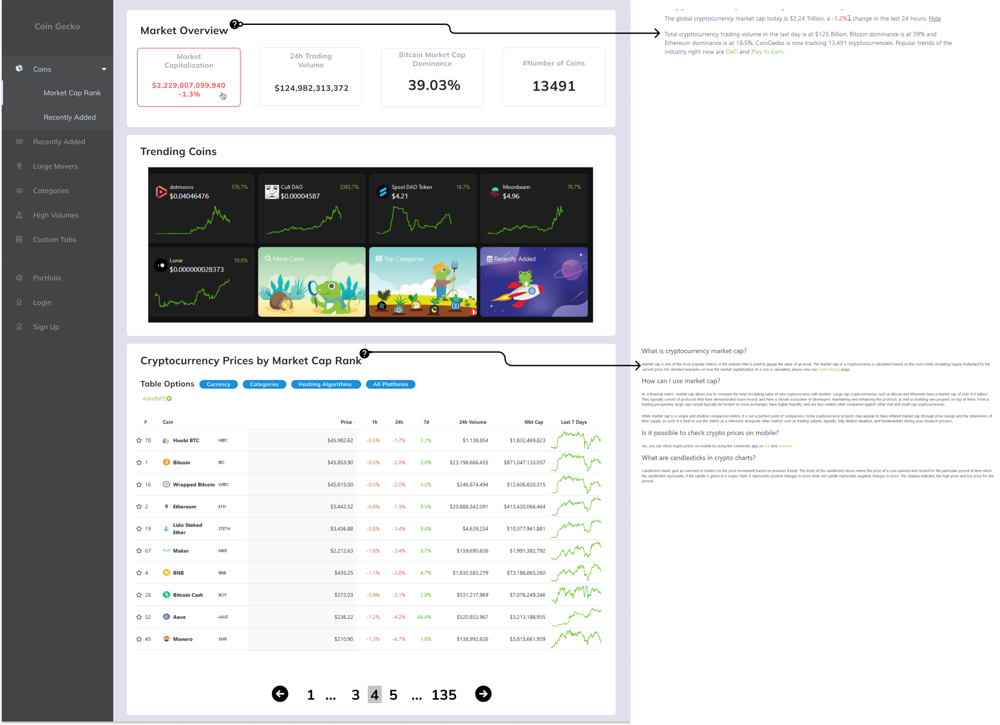

# project-coinbase

```
the name coinbase is not related to any company or any existing party.
The idea of naming this project coinbase is because the data needed to be shown are cryptocurrency and one of the largest crypto in the market is Bitcoin.
Hence why I named the project project-coinbase
```

---

### Tools used:

1. **React ( required )**
2. **@mui ( required )**
3. [React-Pro-Sidebar](https://www.npmjs.com/package/react-pro-sidebar)
4. @mui-icons
5. axios
6. [Thunder Client (API Tester)](https://www.thunderclient.com/)
7. [Airbnb ESLint Prettier Linter](https://dev.to/saurabhggc/add-eslint-prettier-and-airbnb-to-your-project-3mo8)
8. Vercel ( for CI/CD using GitHub Actions )

#### Additional Tool ( used outside coding ):

1. Figma ( for coloring and quick mi-fi mockups ), you can check design [here](https://www.figma.com/file/qPXOFeTqLm5U5rfEQDHbsY/TableBoard?node-id=0%3A1)


2. GitHub Project's Kanban Board ( for Task Management ), you can check the board [here](https://github.com/rickyfelix19/project-coinbase/projects/1)
3. Website Production, go to production page [here](https://project-coinbase.vercel.app/)

---

#### Timeline

- Saturday, starting 4 PM - 5 PM
  -- Initialize Project
  -- Install Dependencies
  -- Work on Kanban Board

- Sunday, 10:25 AM
  -- Started Working on Code / Design
  -- Finish Design MiFI
  -- Finish React Sidebar with minor bugs
- Monday, 2:42 AM
  -- Setup Pipeline and GitHub Actions for Vercel CI/CD
- Monday, 1:32
  -- Start working again
  -- Finish creating UI Component for market overview and trending
- Tuesday 5:40 AM
  -- Finish generating table from API
  
## Tuesday 6:18 AM Push Production to Vercel and Stop Working on Master Branch
